# CommonGrants protocol

A common language for grant data.

CommonGrants is an open standard for sharing data about funding opportunities, applications, and awards across the grants ecosystem.

## Key resources
- [DeepWiki link](https://deepwiki.com/HHS/simpler-grants-protocol): gives a continuously updated view of the entire repo, including diagrams and the ability to interactively search and ask questions about the repo.
- [Protocol website](https://commongrants.org)
  - [Quickstart guide](https://commongrants.org/getting-started): Learn how to define a CommonGrants API using TypeSpec.
  - [OpenAPI docs](https://commongrants.org/protocol/api-docs): The OpenAPI docs for routes currently supported by the CommonGrants protocol.
  - [Technical specification](https://commongrants.org/protocol/specification): The technical specification for the CommonGrants protocol.
  - [Models](https://commongrants.org/protocol/models): The models for the CommonGrants protocol.
- Published packages:
  - [@common-grants/core](https://www.npmjs.com/package/@common-grants/core): TypeSpec library with the CommonGrants specification.
  - [@common-grants/cli](https://www.npmjs.com/package/@common-grants/cli): Command-line tool for working with the CommonGrants specification.  
- Repository sections:
  - [Website](website): The code for our public website and docs.
  - [Libraries](lib): The code for the CommonGrants public packages and libraries:
    - [@common-grants/core](lib/core): The TypeSpec library with the CommonGrants specification.
    - [@common-grants/cli](lib/cli): The command-line tool for working with the CommonGrants protocol.
    - [python-sdk](lib/python-sdk): The Python SDK to streamline adoption of CommonGrants in Python applications.
  - [Templates](templates): Templates with boilerplate code for implementing the CommonGrants protocol.
  - [Examples](examples): Examples implementations of the CommonGrants protocol.
- Community docs:
  - [Code of conduct](CODE_OF_CONDUCT.md): Our community guidelines.
  - [Contributing](CONTRIBUTING.md): How to contribute to the CommonGrants project.
  - [Security policy](SECURITY.md): How to report a security issue.

## Upcoming features

We use [Fider](https://fider.io/) to collect feedback and prioritize features. You can vote for features using [our co-planning board](https://commongrants.fider.io).

### Feature dependencies

Here are the dependencies between features on our co-planning board:

```mermaid

flowchart LR

  %% ─────────────────────────────
  %% Styles
  %% ─────────────────────────────
  classDef default fill:#fff,stroke:#333,stroke-width:1px,color:#000,rx:5,ry:5
  classDef InProgress fill:#e1f3f8,stroke:#07648d,stroke-width:2px,color:#000
  classDef Done fill:#8DE28D,stroke:#204e34,stroke-width:3px,color:#000
  style Canvas fill:transparent,stroke:#171716
  style Legend fill:#F7F7F4,stroke:#171716
  style sdk fill:#F7F7F4,stroke:#171716
  style website fill:#F7F7F4,stroke:#171716
  style cli fill:#F7F7F4,stroke:#171716
  style template fill:#F7F7F4,stroke:#171716

  %% ─────────────────────────────
  %% Legend
  %% ─────────────────────────────
  subgraph Legend["Key"]
    direction LR
    k1["Todo"]
    k2["In progress 🛠️ "]:::InProgress
    k3["Done ✔️"]:::Done

    k1 -.-> k2 -.-> k3
  end

  %% ─────────────────────────────
  %% Main canvas
  %% ─────────────────────────────
  subgraph Canvas["Dependencies"]
    direction LR


    subgraph sdk["SDK"]
    direction LR
        HHS/simpler-grants-protocol#321["Create a TypeScript SDK"]
        HHS/simpler-grants-protocol#323["Create a Go SDK"]
        HHS/simpler-grants-protocol#324["Create a Python API client"]
        HHS/simpler-grants-protocol#328["Create a TypeScript API client"]
        HHS/simpler-grants-protocol#329["Create a Go API client"]
        HHS/simpler-grants-protocol#342["Create a Python SDK"]:::Done
    end


    subgraph website["Website"]
    direction LR
        HHS/simpler-grants-protocol#330["Create a custom fields catalog"]
        HHS/simpler-grants-protocol#334["Add mock API playground to CommonGrants.org"]
    end


    subgraph cli["CLI"]
    direction LR
        HHS/simpler-grants-protocol#331["Make API spec validation configurable"]
        HHS/simpler-grants-protocol#335["Create GH action and badge for CommonGrants compliance"]
    end


    subgraph template["Template"]
    direction LR
        HHS/simpler-grants-protocol#332["Create an Express.js API template"]
        HHS/simpler-grants-protocol#333["Create a Go API template"]
        HHS/simpler-grants-protocol#343["Create a FastAPI template"]:::Done
    end


    %% ─────────────────────────────
    %% Relationships
    %% ─────────────────────────────
    HHS/simpler-grants-protocol#321 --> HHS/simpler-grants-protocol#332
    HHS/simpler-grants-protocol#321 --> HHS/simpler-grants-protocol#328
    HHS/simpler-grants-protocol#323 --> HHS/simpler-grants-protocol#333
    HHS/simpler-grants-protocol#323 --> HHS/simpler-grants-protocol#329
    HHS/simpler-grants-protocol#331 --> HHS/simpler-grants-protocol#335
    HHS/simpler-grants-protocol#342 --> HHS/simpler-grants-protocol#343
    HHS/simpler-grants-protocol#342 --> HHS/simpler-grants-protocol#324

  end

```

