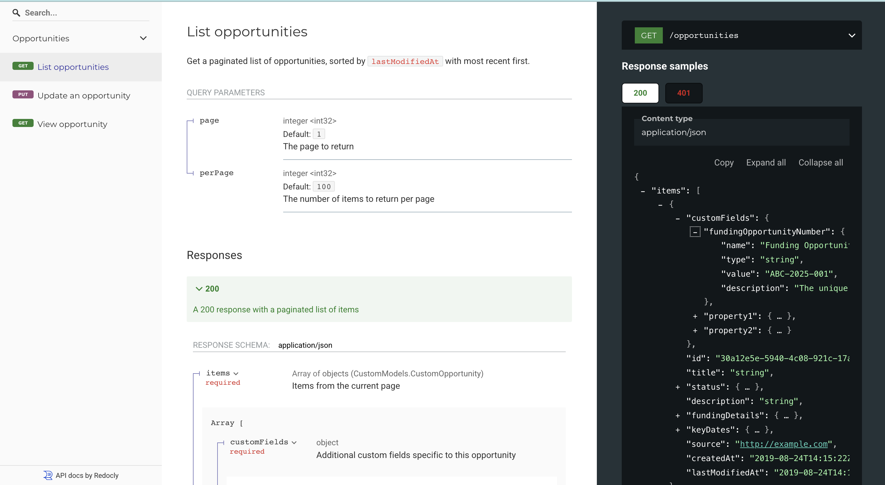

# Custom API example

Example codebase that demonstrates how to import and use the [simpler grant protocol TypeSpec library](../../specs/)

## 🚀 Project Structure

The `examples/custom-api/` sub-directory is organized like this:

```
.
├── src/
│   ├── models.tsp              # Defines a custom field and extends the base Opportunity model
│   └── routes.tsp              # Extends the base Opportunity router to add additional routes
|
├── tsp-output/                 # .gitignored directory that stores the output of `npm run typespec`
│   ├── @typespec/json-schema   # Stores the JSON schemas emitted by `npm run typespec`
│   └── @typespec/openapi3      # Stores the OpenAPI spec emitted by `npm run typespec`
|
├── package.json                # Manages dependencies and commands for the Custom API spec
├── tsconfig.json               # Manages TypeScript configuration
└── tspconfig.yaml              # Manages TypeSpec configuration and emitters
```

## 💻 Local development

### Pre-requisites

Node version 20 or later. Check with `node --version`

### Commands

All commands are run from the root of the project, from a terminal:

| Command                | Action                                           |
| :--------------------- | :----------------------------------------------- |
| `npm install`          | Installs dependencies                            |
| `npm typespec`         | Compile and emit the custom TypeSpec             |
| `npm run docs`         | Generate and view the OpenAPI docs for this spec |
| `npm run format`       | Run automatic formatting and fix issues          |
| `npm run lint`         | Run automatic linting and fix issues             |
| `npm run check:format` | Check formatting, fail if issues are found       |
| `npm run check:lint`   | Check linting, fail if issues are found          |

### Running locally

Run the following steps from the root of this directory to install the custom API package and emit JSON Schema and OpenAPI specs for the custom API using TypeSpec:

1. Install the package: `npm install`
2. Compile and emit the specs for this custom API: `npm run typespec`
3. View the auto-generated OpenAPI spec docs: `npm run docs`

### Defining custom fields

You can define custom field by using `extends CustomField {}` where `CustomField` is a model from the base specification library, see an example below:

```typespec
// models.tsp
import "@common-grants/core"; // Import the base specification library

// Allows us to use models defined in the specification library
// without prefixing each model with `CommonGrants.Models.`
using CommonGrants.Models;

namespace CustomAPI.CustomModels;

model OpportunityNumber extends CustomField {
    name: "Funding Opportunity Number";
    type: CustomFieldType.string;

    @example("ABC-2025-001")
    value: string;

    description: "The unique identifier for a given opportunity within this API";
}
```

Once defined, these custom fields can be used to specify a custom implementation of the base `Opportunity` model:

```typespec
// Include code from above example

model CustomOpportunity extends OpportunityBase {
    customFields: {
        fundingOpportunityNumber: OpportunityNumber;
    };
}
```

### Overriding default routes

Once defined, this custom field can be used to override the the routes from the base specification library.

```typespec
// routes.tsp

import "@common-grants/core";
import "./models.tsp"; // Import the custom field and model from above

using CommonGrants.Routes;
using TypeSpec.Http;

@tag("Opportunities")
@route("/opportunities")
namespace CustomAPI.CustomRoutes {
    alias OpportunitiesRouter = Opportunities;

    // Override the default return type for the lis and read operations
    // using the new CustomOpportunity model
    op list is OpportunitiesRouter.list<CustomModels.CustomOpportunity>;
    op read is OpportunitiesRouter.read<CustomModels.CustomOpportunity>;
}
```

### Defining an API service

Finally, you can use these updated routes to define an API service

```typespec
// main.tsp
import "@typespec/http";

import "./routes.tsp"; // Import the overridden route from above

using TypeSpec.Http;

/** Add the Custom API description here */
@service(#{ title: "Custom API" })
namespace CustomAPI;
```

### Preview the docs

Preview the auto-generated docs with these changes by running `npm run docs` which should open a page that looks roughly like this:



### Full example

See the full example by exploring the code in the [`src/`](src) directory:
