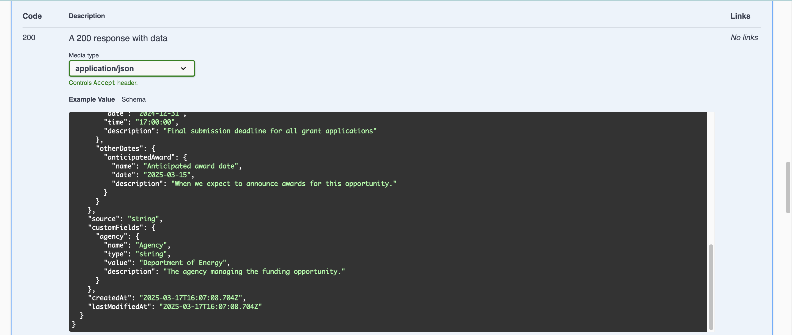

import { FileTree, Steps, CardGrid, LinkCard } from "@astrojs/starlight/components";

Welcome to the CommonGrants protocol documentation. This guide will help you get started with understanding and implementing the protocol.

## Find your way around

<CardGrid>
  <LinkCard title="About CommonGrants" href="/about/" description="Understand the vision and goals behind the CommonGrants protocol." />
  <LinkCard title="API docs" href="/protocol/api-docs/" description="Browse the API endpoints supported by CommonGrants APIs." />
  <LinkCard title="Quickstart" href="#quickstart" description="Start defining a CommonGrants API using our developer tools." />
  <LinkCard title="Specification" href="/protocol/specification/" description="Deep dive into the technical details of the CommonGrants protocol." />
</CardGrid>

## What is CommonGrants?

CommonGrants is a protocol designed to standardize how data about funding opportunities, applications, and awards is shared across the grant ecosystem.

The CommonGrants protocol is built on top of [TypeSpec](https://typespec.io/), a language for describing APIs that compiles to OpenAPI, JSON Schema, and other formats. To simplify the process of adopting this protocol, CommonGrants has published both:

- A TypeSpec library [`@common-grants/core`](https://www.npmjs.com/package/@common-grants/core) with a default set of models and routes
- A CLI tool [`@common-grants/cli`](https://www.npmjs.com/package/@common-grants/cli) to help you define and validate your API implementation

## Quickstart

The following tutorial will walk you through:

- Creating a new CommonGrants API specification using TypeSpec
- Compiling your project to OpenAPI and previewing it with Swagger
- Extending the base CommonGrants spec to include a custom field
- Viewing this new field in the OpenAPI docs

:::note[Prerequisites]

Make sure you have Node.js v18+ and npm v10+ installed. If you need to manage multiple versions of Node, we recommend using [nvm](https://github.com/nvm-sh/nvm).

```bash
node --version
npm --version
```

:::

### First steps

First, we'll show you how to set up and preview the default CommonGrants API specification using the CLI and quickstart template.

<Steps>

1. Install the CLI globally

   ```bash
   npm install @common-grants/cli -g
   ```

2. Create a new directory for your project

   ```bash
   mkdir common-grants-quickstart
   cd common-grants-quickstart
   ```

3. Initialize your project with the quickstart template.

   **Note:** The TypeSpec compiler will warn you about using an untrusted template. This is expected and the template is safe to use.

   ```bash
   cg init --template quickstart
   ```

   Follow the prompts and accept the default options.

   ```bash
   ✔ Continue Yes
   ✔ Enter a project name: common-grants-quickstart
   ✔ Installing dependencies

   success: Project initialized!
   ```

4. Compile and preview your API specification at `http://localhost:3000`

   ```bash
   cg compile main.tsp
   cg preview tsp-output/@typespec/openapi3/openapi.Quickstart.yaml
   ```

</Steps>

### Deep dive

Next, we'll take a step back and walk you through what happened behind the scenes when you ran the CLI commands listed above.

If you want to jump straight into customizing the API spec, feel free to skip ahead to the [Customization](#customization) section.

:::tip
To make the deep dive sections easier to follow, we recommend installing the [TypeSpec VSCode extension](https://marketplace.visualstudio.com/items?itemName=typespec.typespec-vscode) which provides syntax highlighting and autocomplete for TypeSpec files.
:::

#### Explore the files created by `cg init`

When you run `cg init` it sets up a new CommonGrants project in the `common-grants-quickstart` directory with the following files:

<FileTree>

- main.tsp # Defines the API service
- routes.tsp # Defines the API routes
- tspconfig.yaml # Configures TypeSpec emitters (e.g. OpenAPI)
- package.json # Manages project dependencies
- .gitignore # Ignores files from the project
- README.md # The project README

</FileTree>

We'll focus on exploring the following files in particular:

- [`routes.tsp`](#understanding-routestsp)
- [`main.tsp`](#understanding-maintsp)
- [`tspconfig.yaml`](#understanding-tspconfigyaml)

##### Understanding `routes.tsp`

The `routes.tsp` file is the TypeSpec file that defines the API routes.

```tsp title=routes.tsp
import "@common-grants/core";

using TypeSpec.Http;

@tag("Opportunities")
@route("/common-grants/opportunities")
namespace Quickstart.Routes {
  alias OpportunitiesRouter = CommonGrants.Routes.Opportunities;

  op list is OpportunitiesRouter.list;
  op read is OpportunitiesRouter.read;
  op search is OpportunitiesRouter.search;
}
```

Since there's a lot happening here, let's break it down section by section.

<Steps>

1. Import the CommonGrants TypeSpec library.

   ```tsp
   import "@common-grants/core";
   ```

2. Expose the `TypeSpec.Http` namespace.

   ```tsp
   using TypeSpec.Http;
   ```

   This makes the `@route` and `@tag` keywords available in the current namespace without requiring the `TypeSpec.Http` prefix.

3. Define a namespace for the `OpportunitiesRouter`.

   ```tsp
   @tag("Opportunities")
   @route("/common-grants/opportunities")
   namespace Quickstart.Routes {
     alias OpportunitiesRouter = CommonGrants.Routes.Opportunities;
     // operations omitted for brevity
   }
   ```

   Think of the `OpportunitiesRouter` as a controller in a traditional MVC framework that groups related routes together under the `Opportunities` tag and exposes them at the `/common-grants/opportunities` path.

4. Expose the default routes from the CommonGrants library.

   ```tsp {6-8}
   @tag("Opportunities")
   @route("/common-grants/opportunities")
   namespace Quickstart.Routes {
     alias OpportunitiesRouter = Opportunities;

     op list is OpportunitiesRouter.list;
     op read is OpportunitiesRouter.read;
     op search is OpportunitiesRouter.search;
   }
   ```

   This exposes the following default routes from the CommonGrants library:

   - `GET /common-grants/opportunities`
   - `GET /common-grants/opportunities/{id}`
   - `POST /common-grants/opportunities/search`

</Steps>

##### Understanding `main.tsp`

The `main.tsp` file is the TypeSpec file that defines the API service.

```tsp title=main.tsp
import "@typespec/http";
import "./routes.tsp";

using TypeSpec.Http;

/** API description here */
@service(#{ title: "Quickstart API" })
namespace Quickstart;
```

Let's break down the `main.tsp` file section by section.

<Steps>

1. Import the TypeSpec HTTP module and the `routes.tsp` file.

   ```tsp
   import "@typespec/http";
   import "./routes.tsp";
   ```

   Importing the `routes.tsp` includes the routes from that file in the OpenAPI document generated by the `cg compile` command.

2. Expose the `TypeSpec.Http` namespace.

   ```tsp
   using TypeSpec.Http;
   ```

   This makes the `@service` keyword available in the current namespace without requiring the `TypeSpec.Http` prefix.

3. Define the API service.

   ```tsp
   /** API description here */
   @service(#{ title: "Quickstart API" })
   namespace Quickstart;
   ```

   This defines the API service with a title of "Quickstart API". The `@service` keyword is used to define the API service and is required for the OpenAPI emitter to work. The `title` property is used to set the title of the API and the docstring is used to set the description of the API in the OpenAPI docs.

</Steps>

##### Understanding `tspconfig.yaml`

The `tspconfig.yaml` file is the TypeSpec configuration file that defines the emitters for the project.

```yaml title=tspconfig.yaml
emitters:
  - "@typespec/openapi3"
  - "@typespec/json-schema"
```

This configures the TypeSpec compiler to emit the API definition as an OpenAPI document and a JSON Schema.

#### Explore the packages installed by `cg init`

When you run `cg init`, the following packages are installed (among others):

- [`@common-grants/core`](https://www.npmjs.com/package/@common-grants/core) The CommonGrants TypeSpec library, which includes a default set of models and routes that can be used to define your own CommonGrants API.
- [`@typespec/openapi3`](https://www.npmjs.com/package/@typespec/openapi3) The OpenAPI emitter for TypeSpec, which emits the CommonGrants API definition as an OpenAPI document.
- [`@typespec/json-schema`](https://www.npmjs.com/package/@typespec/json-schema) The JSON Schema emitter for TypeSpec, which emits the models in your CommonGrants API as JSON Schemas.

#### Explore the files created by `cg compile`

This will create a `tsp-output` directory with the following files compiled from `main.tsp`:

<FileTree>

- `tsp-output/`
  - `@typespec/`
    - `openapi3/` Auto-generated by the OpenAPI emitter
      - `openapi.CommonGrants.yaml` The base CommonGrants API spec
      - `openapi.Quickstart.yaml` The quickstart API spec
    - `json-schema/` Auto-generated by the JSON Schema emitter
      - `CustomEnumValue.yaml`
      - `Opportunity.yaml`
      - ...

</FileTree>

#### Understanding the `cg preview` command

The `cg preview` command starts a local server that serves the OpenAPI specification using Swagger UI. View your API specification at `http://localhost:3000`.

### Customization

Finally, we'll show you how to extend the base CommonGrants API specification with a custom field.

:::tip
To make the customization process easier to follow, we recommend installing the [TypeSpec VSCode extension](https://marketplace.visualstudio.com/items?itemName=typespec.typespec-vscode) which provides syntax highlighting and autocomplete for TypeSpec files.
:::

#### Add a custom field to the `Opportunity` model

Create a new file called `models.tsp` with the following code:

```tsp title=models.tsp
import "@common-grants/core";

// Allows us to use models defined in the specification library
// without prefixing each model with `CommonGrants`
using CommonGrants.Models;
using CommonGrants.Fields;

namespace Quickstart.Models;

model Agency extends CustomField {
  name: "Agency";
  type: CustomFieldType.string;
  value: string;
  description: "The agency managing the funding opportunity.";
}

// Create a custom Opportunity type using the template
model CustomOpportunity extends OpportunityBase {
  @example(#{
    agency: #{
      name: "Agency",
      type: CustomFieldType.string,
      value: "Department of Energy",
      description: "The agency managing the funding opportunity.",
    },
  })
  customFields: {
    agency: Agency;
  };
}
```

There's a lot happening here, so let's break it down section by section.

<Steps>

1. Import the CommonGrants TypeSpec library.
   ```tsp
   import "@common-grants/core";
   ```
2. Make the CommonGrants fields, models, etc. available in the current namespace.

   ```tsp
   using CommonGrants.Fields;
   using CommonGrants.Models;
   ```

   Without this, you would have to prefix each model with `CommonGrants.Models` and each field with `CommonGrants.Fields`. For example `CommonGrants.Fields.CustomField`.

3. Declare a namespace for the current file.
   ```tsp
   namespace Quickstart.Models;
   ```
4. Define a custom field by extending the `CustomField` model.

   ```tsp
   model Agency extends CustomField {
     name: "Agency";
     type: CustomFieldType.string;
     value: string;
     description: "The agency managing the funding opportunity.";
   }
   ```

   The `Agency` model defines literal values for the field's `name`, `type`, and `description` metadata properties, and requires the `value` property to be a string.

5. Extend the `OpportunityBase` model to include this custom field.
   ```tsp
   model CustomOpportunity extends Models.OpportunityBase {
     // Example omitted for brevity
     customFields: {
       agency: Agency;
     };
   }
   ```
   It also provides an example of the updated `customFields` property, which will be displayed in the OpenAPI docs.
   ```tsp {2-11}
   model CustomOpportunity extends Opportunity.OpportunityBase {
    @example(
        #{
            agency: #{
                name: "Agency",
                type: Fields.CustomFieldType.string,
                value: "Department of Energy",
                description: "The agency managing the funding opportunity."
            }
        }
    )
    customFields: {
        agency: Agency;
        };
   }
   ```

</Steps>

#### Update the default routes

Update the `routes.tsp` file and make the following changes:

- Import the `models.tsp` file to expose the `CustomOpportunity` model.
- Update the routes to use the `CustomOpportunity` model.

```tsp title=routes.tsp ins={2,14-16} del={11-13}
import "@common-grants/core";
import "./models.tsp";

using TypeSpec.Http;

@tag("Opportunities")
@route("/common-grants/opportunities")
namespace Quickstart.Routes {
  alias OpportunitiesRouter = CommonGrants.Routes.Opportunities;

  op list is OpportunitiesRouter.list;
  op read is OpportunitiesRouter.read;
  op search is OpportunitiesRouter.search;
  op list is OpportunitiesRouter.list<Models.CustomOpportunity>;
  op read is OpportunitiesRouter.read<Models.CustomOpportunity>;
  op search is OpportunitiesRouter.search<Models.CustomOpportunity>;
}
```

Let's explain these changes section by section.

<Steps>

1. Import the `models.tsp` file to expose the `CustomOpportunity` model.

   ```tsp
   import "./models.tsp";
   ```

2. Update the default routes to use the `CustomOpportunity` model.

   ```tsp {6-8}
   @tag("Opportunities")
   @route("/common-grants/opportunities")
   namespace Quickstart.Routes {
     alias OpportunitiesRouter = Opportunities;

     op list is OpportunitiesRouter.list<Models.CustomOpportunity>;
     op read is OpportunitiesRouter.read<Models.CustomOpportunity>;
     op search is OpportunitiesRouter.search<Models.CustomOpportunity>;
   }
   ```

   This updates `GET /opportunities` and `GET /opportunities/{id}` to return our `CustomOpportunity` model instead of the default model from the CommonGrants library.

</Steps>

The updated `routes.tsp` file should now look like this:

```tsp title=routes.tsp
import "@common-grants/core";
import "./models.tsp";

using TypeSpec.Http;

@tag("Opportunities")
@route("/common-grants/opportunities")
namespace Quickstart.Routes {
  alias OpportunitiesRouter = CommonGrants.Routes.Opportunities;

  op list is OpportunitiesRouter.list<Models.CustomOpportunity>;
  op read is OpportunitiesRouter.read<Models.CustomOpportunity>;
  op search is OpportunitiesRouter.search<Models.CustomOpportunity>;
}
```

#### View your changes

```bash
cg compile main.tsp
cg preview tsp-output/@typespec/openapi3/openapi.Quickstart.yaml
```

This should start a local server that serves the OpenAPI specification using Swagger UI. View your API specification at `http://localhost:3000`.

Specifically look for the `agency` field in the `customFields` property of the `Opportunity` model at `http://localhost:3000/#/Opportunities/Routes_read`. It should look something like this:



## Next steps

Learn more about the CommonGrants protocol:

- [About CommonGrants](/about/)
- [Specification](/protocol/specification/)

Learn more about TypeSpec:

- [TypeSpec documentation](https://typespec.io/docs)
- [TypeSpec GitHub repository](https://github.com/microsoft/typespec)
