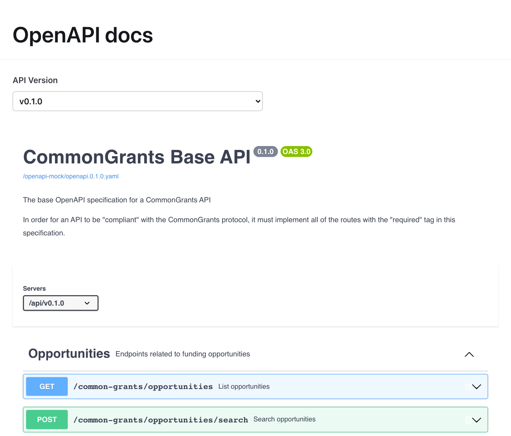
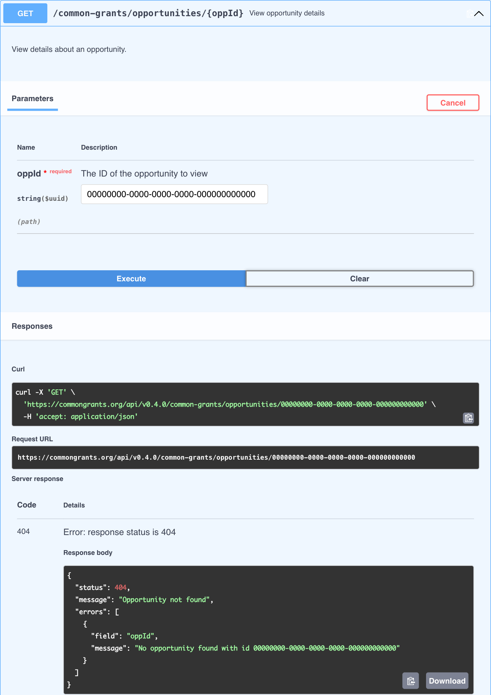

We want visitors to test the CommonGrants API against a mock for every published spec version (v0.1.0 to v0.4.0). We're turning Swagger UI's "Try it out" back on in the browser-- but our core goal is **determinism**. A user should be able to try a request in the browser, copy the `curl` command and run it in their terminal, point the SDK at the same URL, and get the **same data** every time. The mock also gives the quickstart a sandbox: a new SDK user can fetch realistic grant data with no local setup.

So the mock has three consumers:

1. **Browser:** "Try it out" in the rendered docs.
2. **CLI:** the `curl` command copied from the docs.
3. **SDK:** the quickstart's first exercise ("use the SDK to fetch data").

A browser-only mock cannot serve the last two. The question became where a real mock endpoint should live. We compared two shapes for a real endpoint: a _standalone Cloudflare Worker_ and an _endpoint served by the docs website itself_. This ADR records the findings and the final decision.

### Why this matters

Before this, the docs described every route and field, but you could not interact with any of it. To see a real response you had to stand up an implementation or read the schema and imagine. Now every documented endpoint has a working mock behind it, at the same address as the docs, with no key, account, or install. Here is what that unlocks: 

   - **Someone evaluating CommonGrants** opens the docs, expands an endpoint, and clicks Execute. Every ID box is pre-filled with a record that exists, so the first click returns realistic data. Learning the protocol becomes interactive.

     - 

   - **A partner still on an older version** switches the dropdown to v0.1.0 and asks for the same record. Fields added later are gone, and resources that did not exist yet drop out of the page. The version rides in the URL, so the view can be shared as a link.

      - 

   - **An integration engineer** points Postman, `curl`, or the SDK at the sandbox URL and starts building today, before any funder has shipped a real endpoint. The dataset is big enough that paging, sorting, and filtering visibly change what comes back. What they build against the sandbox is what they will ship against a real implementation. The `curl` the docs generate runs unchanged:

      ```bash
      BASE=https://commongrants.org/api
      OPP=30a12e5e-5940-4c08-921c-17a8960fcf4b

      curl -s $BASE | jq .supportedVersions
      # ["0.1.0","0.2.0","0.3.0","0.4.0"]

      curl -s $BASE/v0.4.0/common-grants/opportunities/$OPP | jq .data.title
      # "Small business grant program"

      curl -s $BASE/v0.1.0/common-grants/opportunities/$OPP | jq '.data | keys'
      # same record, no "competitions" or "acceptedApplicantTypes"

      curl -s "$BASE/v0.4.0/common-grants/opportunities?page=3&pageSize=10" | jq .paginationInfo
      # {"page":3,"pageSize":10,"totalItems":25,"totalPages":3}
      ```

      The TypeScript SDK needs one environment variable. Swap it for a funder's real endpoint later and nothing else changes:

      ```bash
      CG_BASE_URL=https://commongrants.org/api/v0.4.0 pnpm --filter @common-grants/sdk run example:list
      ```

   - **Someone who is implementing error handling** learns the error shape by making mistakes. Every 400 and 404 is the protocol's own error envelope: status, message, and a list of field and message pairs. A missing record names the field. A malformed ID gets a 400 in the same shape. Asking v0.2.0 for awards does not return a blank 404; it says awards arrived in v0.4.0.

      - 

      ```json
      {
        "status": 404,
        "message": "Not found",
        "errors": [
          {
            "field": "path",
            "message": "The awards endpoints were added in v0.4.0 and are not served by v0.2.0"
          }
        ]
      }
      ```

- **Someone building an apply flow** can walk an application from start to submit: look up the competition, start an application (201), fill in a form (echoed back as complete), and submit (200). Submitting an application with problems returns a 400 that lists exactly which fields are wrong--  this reflects the protocol's validation-error shape, live.

Three properties hold across all of this:

- **Version-aware.** Ask for v0.1.0 and you get v0.1.0-shaped records.
- **Errors that teach.** Every error is protocol-shaped, so mistakes are informative.
- **Deterministic.** Writes are validated and echoed back, but nothing is stored. Same request, same answer, for everyone. That makes a sandbox URL safe to paste into a doc, a ticket, or a test.

## Decision

We serve the mock API **from the docs website itself**. It is one dynamic Astro route, mounted at `/api/v{version}/common-grants/...`, deployed with the rest of the site as a Cloudflare Worker. The site keeps `output: "static"`. Every docs page is still prerendered, and the API route is the only code that runs at request time.

The deciding fact came from outside this ADR. The team chose to move the website from GitHub Pages to Cloudflare-- this [ADR 0003](/governance/adr/0003-website-hosting/) noted the switch would be needed if server-side code ever became a requirement. GitHub Pages runs no code. While it was the production host, serving a dynamic route from the site was impossible and the standalone Workers was the only workable shape. The migration is now complete: name servers moved, every merge to `main` was verified on beta.commongrants.org, and the DNS cutover retired the GitHub Pages deploy. With that the `an endpoint served by the docs website itself` option's one big cost is gone and same-origin serving is the simpler shape. Details are under [Option 3](#option-3-real-mock-endpoint-on-cloudflare-chosen-as-3b).

What shipped:

- **Hand-authored fixture data.** 63 records across six resources: 25 opportunities, 11 awards, 8 organizations, 7 applications, 6 forms, and 6 competitions. Filtering, sorting, pagination, and protocol-shaped errors all work. Every resource keeps one record under the ID that Swagger UI pre-fills, so clicking Execute without touching anything returns the documented record.
- **Version in the URL path** (`/api/v0.4.0/...`), so the same URL doubles as an SDK `baseUrl`. Which resources exist in which version comes from the spec's `@added(...)` decorators: opportunities v0.1+; competitions, applications, and forms v0.2+; application search v0.3+; awards and organizations v0.4+.
- **Stateless writes.** POST, PUT, and PATCH requests are validated and echoed back, never stored. A draft ID from "start application" will 404 on a later GET. Data is not mutated.
- **A conformance suite.** CI validates every fixture record, shaped per version, against the per-version JSON Schemas the docs pipeline already generates from TypeSpec. A protocol change flags a stale fixture instead of shipping it silently.
- **Build-time wiring.** The mock's base path is injected as a `servers:` entry into the rendered OpenAPI specs from the same constant the route mounts on, so the specs cannot advertise a path the route does not serve. The URL is relative because the mock is same-origin with the docs.
- **No launch gate.** The mock serves in PR previews and on production alike. Execute is offered only on the verbs the mock implements (GET, POST, PUT, PATCH); the docs panel reads its `supportedSubmitMethods` from the router's own `SUPPORTED_METHODS`.
- **CORS headers kept** for external `curl` and SDK callers, even though same-origin serving makes them unnecessary for the docs panel itself.

### Positive consequences

- One URL and one dataset for all three consumers. The browser to `curl` to SDK round-trip works by construction, and the quickstart can start from the sandbox URL with no local setup.
- Same-origin serving removes the standalone shape's cross-origin plumbing. There is no separate origin to configure, and the `servers:` URL comes from the same constant as the route rather than an environment variable that could drift.
- The website's existing harness covers the mock's tests, lint and format config, and preview deploys. No second package, deploy workflow, or artifact to maintain.
- The conformance tests read the generated schemas straight off disk in the same package, with no cross-package build step.
- Still about $0. The site's Cloudflare Worker scales to zero, and PR previews are versions of the same Worker.

### Negative consequences

- The mock is coupled to how the whole site builds and deploys. Its tests run inside a package whose build takes minutes (TypeSpec compile, generate, Astro), and the Cloudflare adapter's peer requirements now set the site's `astro` and `wrangler` version floor.
- The host framework sits in front of the mock's handlers. Astro's `checkOrigin` CSRF guard answers a plain-text 403 to any non-GET request that carries neither a matching `Origin` nor a non-form `Content-Type`, where a standalone Worker returned a protocol-shaped body. This reaches a route the mock does serve: `PUT /applications/{appId}/submit` takes no request body, so a bare `curl -X PUT` sends no `Content-Type` and is refused before the handler runs. Sending `-H 'Content-Type: application/json'` clears the guard, and the docs panel's own same-origin requests never trip it. The guard stays on. Disabling a site-wide CSRF check to improve one error body would be the worse trade.
- The fixture records, version-shaping rules, and handler logic are hand-maintained. The conformance suite catches schema drift, but keeping the data realistic stays manual work.
- Because nothing is stored, branches that need state cannot be demonstrated yet: a draft that persists across requests, or 401 and 403 responses (auth is documented but not enforced).
- The mock's availability is tied to the site's. They build, deploy, and roll back as one unit, so the endpoint cannot ship or roll back on its own. The one-time form of this cost is already paid: launch was sequenced behind the hosting migration.
- A public endpoint, even a mock, has light operational surface (abuse limits, monitoring).

### Follow-ups under consideration

These are ideas, not commitments:

- **Bring your own API to "Try it out."** Let an integration engineer paste their implementation's base URL, or upload their OpenAPI file, and drive it from the same panel next to the reference. The docs become a conformance workbench.
- **`cg check` against a live URL.** The CLI already checks a spec file. Checking a running server is the natural follow-on, and the sandbox is the fixture that tool would be developed against.
- **Generate fixtures from the schemas.** Deriving records from the SDK's schemas would stop the sandbox from ever drifting from the spec and make new resources or versions nearly free to add.
- **Cover the missing branches.** An optional key to unlock 401 and 403, and a short-lived per-session mode where writes persist.
- **Ship a Postman collection** from the docs site, so "import and send" is the first step in getting started.

## Criteria

- **One mock for all three consumers:** same URL, same data, for the browser, `curl`, and the SDK.
- **SDK sandbox:** a real URL a new user can point the SDK at with no local setup.
- **Fidelity:** deterministic, consistent across endpoints, realistic responses; filters and sorting respected; protocol-shaped errors testable.
- **Versioning:** browse and mock every published spec version.
- **Cost about $0:** no always-on server.
- **Static-first:** stays within, or close to, the static site model.
- **Low maintenance.**

## Options considered

- **Option 1: Client-side mock with MSW.** Fake the network inside the visitor's browser.
- **Option 2: Renderer swap (Scalar / RapiDoc / Redoc).** Replace Swagger UI with a docs renderer that ships its own try-it features.
- **Option 3: Real mock endpoint on Cloudflare (chosen).** In one of two shapes: **3a**, a standalone Worker deployed separately from the docs; or **3b**, the endpoint served by the docs website itself.
- **Option 4: Self-hosted Prism.** Run Stoplight Prism as a real hosted mock server.

## Evaluation

### Side-by-side

- ✅ Criterion met
- ❌ Criterion not met
- 🟡 Partially met or unsure

| Criteria               | 1. MSW (client-side) | 2. Renderer swap | 3. Edge mock endpoint | 4. Self-hosted Prism |
| ---------------------- | :------------------: | :--------------: | :-------------------: | :------------------: |
| One mock for all three |          ❌          |        ❌        |          ✅           |          ✅          |
| SDK sandbox (real URL) |          ❌          |        ❌        |          ✅           |          ✅          |
| Fidelity               |  🟡 (with fixture)   |        🟡        |   ✅ (with fixture)   |  🟡 (dynamic mode)   |
| Versioning             |          ✅          |        ✅        |          ✅           |          ✅          |
| Cost about $0          |          ✅          |        🟡        |          ✅           |          ❌          |
| Static-first           |          ✅          |        ✅        |          🟡           |          ❌          |
| Low maintenance        |          ✅          |        🟡        |          🟡           |          ❌          |

### Option 1: Client-side mock with MSW

:::note[Bottom line]
Client-side MSW is best if:

- we want to prioritize zero new infrastructure: everything stays static, inside the browser
- but can compromise on determinism: `curl` and the SDK can never hit it
  :::

#### How it works

[Mock Service Worker](https://mswjs.io/) registers a service worker, a script the browser runs that intercepts the page's own network requests and answers them locally. This works end to end: a service worker can answer Swagger UI's "Try it out" across the published spec versions with no hosted component.

#### What we learned

These findings apply to every option:

- **Generating responses from the spec is not enough.** MSW's `fromOpenApi()` produces random data on every call. It cannot echo a requested ID back, keep list and detail endpoints consistent, apply filters or sorting, or use the `example` values our TypeSpec compiles to. Any schema-sampling mock has these limits, including Prism's dynamic mode.
- **The fix was a data layer, not an engine fix.** Determinism, cross-endpoint consistency, and working filters came from a hand-authored fixture plus list, detail, and search handlers. That data layer is portable. It is the core of both hosting shapes and ships in the chosen option.
- **The docs site's generated data cannot replace the fixture.** The generated OpenAPI files, JSON Schemas, and schema metadata are schema-level: they describe what an Opportunity looks like but contain no records. What they do well is complement the fixture: the per-version schemas drive version shaping and back the CI conformance tests.
- **A browser-only mock cannot serve the CLI or SDK.** The service worker exists only inside the page. `curl` and the SDK would need a separate local mock, a different engine returning different data, which breaks determinism.

#### Tradeoffs

- **Pros**
  - Works end to end; about $0, fully static, no new deploy artifact.
- **Cons**
  - Fails the determinism goal: two of the three consumers live outside the browser.
  - Needs the same hand-authored fixture layer anyway for fidelity.
  - Service-worker lifecycle (scope, navigation interference, unregister on leave) needs careful handling on a docs site.

### Option 2: Renderer swap (Scalar / RapiDoc / Redoc)

:::note[Bottom line]
A renderer swap is best if:

- we want one library for rendering the docs and the try-it UI
- but can compromise on the mock itself: none of them ship one for free
  :::

#### Tradeoffs

- **Pros**
  - Polished, modern try-it UIs (Scalar, RapiDoc).
- **Cons**
  - Does not solve the mock problem. Scalar's mock is a Node server, RapiDoc's try-it needs a live endpoint, and Redoc OSS is read-only, so we would still need MSW or a hosted endpoint.
  - A full renderer migration diverges from the site's `swagger-ui-dist` direction.

### Option 3: Real mock endpoint on Cloudflare (chosen as 3b)

:::note[Bottom line]
A real mock endpoint is best if:

- we want one URL that serves the browser, `curl`, and the SDK identically at about $0
- and, in the integrated shape (3b), can accept that the docs site needs a host that runs code
  :::

#### How it works

The fixture-backed handlers run on Cloudflare's edge and answer requests at a real URL, with the version selected by path prefix. Two deployment shapes were candidates. **3a** is a standalone Worker in its own package, deployed separately and called cross-origin by the docs. **3b** is the same kernel mounted as the docs site's one dynamic Astro route, same-origin, deployed with the site.

#### How the two shapes compare

Both shapes were built and measured against the same rubric.

- **Surface area.** After the hosting migration removed the GitHub Pages compatibility work, 3b measured **26 files vs. 3a's 31**. What 3b really deletes is package scaffolding and a dedicated deploy workflow. What it adds back is entanglement: the mock now touches `astro.config.mjs`, `wrangler.jsonc`, and the site's deploy workflow.
- **Co-location helps less than expected.** The real wins are that the `servers:` URL and the route share one constant, and the conformance tests read the generated schemas locally. Fixture values and handler logic are hand-maintained in both shapes. Only a conformance test notices a protocol change, and it is the same test either way.
- **The fact that first pointed to 3a.** GitHub Pages is a static file server and runs no code, and no Astro adapter changes that. So 3b required moving the docs site to a runtime host, a migration that [ADR 0003](/governance/adr/0003-website-hosting/) chose against and that had to be decided on its own merits, not smuggled in as mock-API work. Under the assumption that GitHub Pages stays, 3a was the better shape.
- **The reversal.** On 2026-08-19 the team decided to migrate the website to Cloudflare regardless. The migration was already planned work (parallel deploy on every merge, verification on beta.commongrants.org, DNS cutover, then retiring the Pages deploy), not a cost of choosing 3b. Once the docs site runs on a host that runs code, 3b becomes the better shape, and it became the launch vehicle.
- **Determinism check, passed.** Swagger UI "Try it out", the copied `curl` command, and the TypeScript SDK were pointed at the same build and asked for the canonical record. The Swagger UI and `curl` responses match byte for byte. The SDK returns the same record after its own response parsing. The check also surfaced an SDK bug, since fixed: `Client.get()` re-applied `baseUrl` to requests with query params, which broke `list()` under path-prefix versioning.

#### Tradeoffs

- **Pros**
  - One URL, one dataset, for all three consumers. Determinism and the quickstart sandbox are met by construction.
  - Free tier, scale to zero. The site's harness covers the mock's test, lint, and deploy scaffolding.
  - Same-origin: no CORS or absolute base URL plumbing for the docs panel, and no second origin, account, or DNS name to own.
- **Cons**
  - Requires the docs host to run code. Viable only because of the independently decided Cloudflare migration, which has since landed.
  - Mock CI pays the website's build cost, and host middleware (`checkOrigin`) sits in front of the handlers.

### Option 4: Self-hosted Prism

:::note[Bottom line]
Self-hosted Prism is best if:

- we want maximal built-in request validation from a real mock server
- but can compromise on recurring hosting cost and ongoing maintenance
  :::

#### Tradeoffs

- **Pros**
  - Real request validation and error negotiation out of the box; natively understands multiple spec files.
- **Cons**
  - Prism is Node-only. It runs on neither the browser nor Cloudflare Workers, so hosting it means a container: recurring cost and an always-on service to maintain.
  - Its dynamic mode has the same random-data problem the fixture exists to solve, so the fixture layer would still be needed. Overkill for a docs-site mock.
